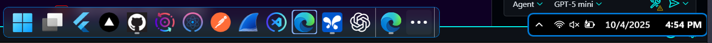
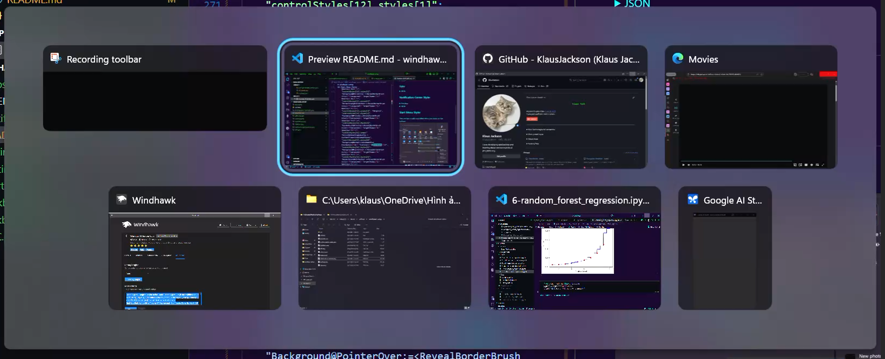
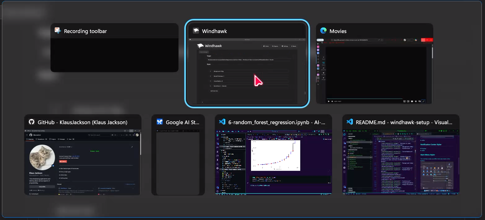
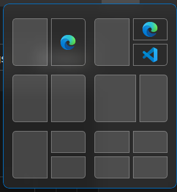
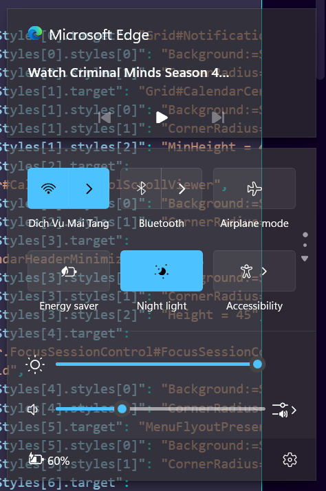
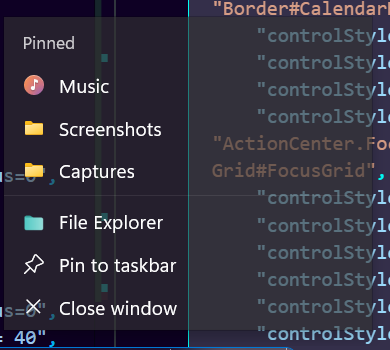
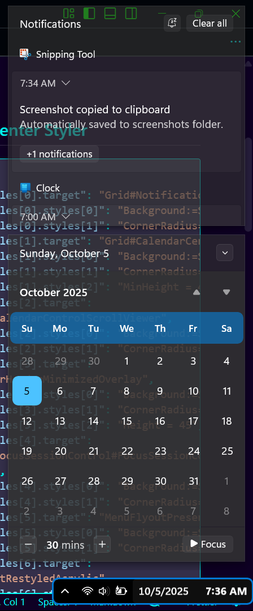
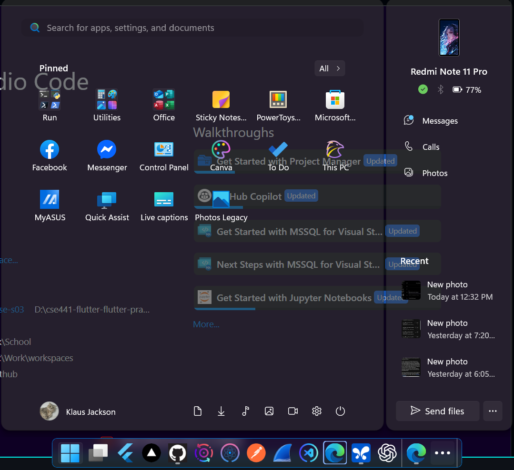
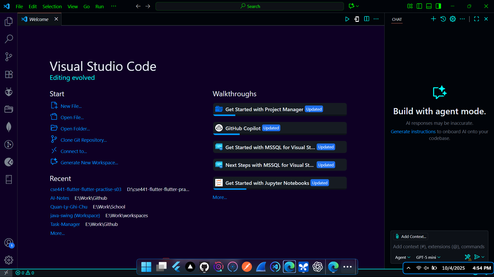

# windhawk-setup

My windhawk setup. You can copy and keep the things you like, change the things you don't.

## Common Style Constants

-   background =<WindhawkBlur BlurAmount=\"0\" TintColor=\"#A0323232\"/>

BlueAmount="0" meaning it won't blur the background.
You can change the TintColor if the text is hard to see, use a dark color if text color is white and vice versa.

## Taskbar

You will need both mods for this to work.

**Notes about my Styler JSON:**

-   It also changes your AltTab and Window Tilting.
-   Open apps but not active has orange border, active app has blue border, group apps (like many instances of Chrome, Edge) has none. This doesn't always work, it sometimes switches back to the little dot like you see in the preview.



### Height and Icon Size

<details>
    <summary>JSON</summary>

    ```json
    {
        "TaskbarHeight": 58,
        "IconSize": 32,
        "TaskbarButtonWidth": 44,
        "IconSizeSmall": 16,
        "TaskbarButtonWidthSmall": 32
    }
    ```

</details>

### Styler

<details>
    <summary>AltTab + Window Tilting Previews</summary>





```json
{
	"controlStyles[18].target": "WindowsInternal.ComposableShell.Experiences.Switcher.AltTab > Windows.UI.Xaml.Controls.Grid#ModalRootGrid > Border",
	"controlStyles[18].styles[0]": "Background:=$bg",
	"controlStyles[18].styles[1]": "BorderThickness=1",
	"controlStyles[18].styles[2]": "CornerRadius=8",
	"controlStyles[18].styles[3]": "BorderBrush := $border"
}
```

</details>

<details>
    <summary>JSON</summary>

```json
{
	"controlStyles[0].target": "Taskbar.TaskbarFrame",
	"controlStyles[0].styles[0]": "Width=Auto",
	"controlStyles[0].styles[1]": "HorizontalAlignment=Center",
	"controlStyles[0].styles[2]": "Margin=250,0,250,0",
	"controlStyles[1].target": "Taskbar.TaskbarFrame > Grid#RootGrid",
	"controlStyles[1].styles[0]": "Background:=$bg",
	"controlStyles[1].styles[1]": "Padding=6,0,6,0",
	"controlStyles[1].styles[2]": "CornerRadius=8",
	"controlStyles[1].styles[3]": "BorderBrush:=$border",
	"controlStyles[2].target": "Taskbar.TaskbarFrame > Grid#RootGrid > Taskbar.TaskbarBackground > Grid > Rectangle#BackgroundFill",
	"controlStyles[2].styles[0]": "Visibility=Collapsed",
	"controlStyles[3].target": "Rectangle#BackgroundStroke",
	"controlStyles[3].styles[0]": "Visibility=Collapsed",
	"controlStyles[4].target": "Taskbar.AugmentedEntryPointButton#AugmentedEntryPointButton > Taskbar.TaskListButtonPanel#ExperienceToggleButtonRootPanel",
	"controlStyles[4].styles[0]": "Margin=0",
	"controlStyles[5].target": "Grid#SystemTrayFrameGrid",
	"controlStyles[5].styles[0]": "Background:=<WindhawkBlur BlurAmount=\"50\" TintColor=\"#000000\"/>",
	"controlStyles[5].styles[1]": "CornerRadius=8",
	"controlStyles[5].styles[2]": "BorderThickness=2",
	"controlStyles[6].target": "SystemTray.ChevronIconView",
	"controlStyles[6].styles[0]": "Padding=0",
	"controlStyles[7].target": "SystemTray.NotifyIconView#NotifyItemIcon",
	"controlStyles[7].styles[0]": "Padding=0",
	"controlStyles[8].target": "SystemTray.OmniButton",
	"controlStyles[8].styles[0]": "Padding=0",
	"controlStyles[9].target": "SystemTray.CopilotIcon",
	"controlStyles[9].styles[0]": "Padding=0",
	"controlStyles[10].target": "SystemTray.OmniButton#NotificationCenterButton > Grid > ContentPresenter > ItemsPresenter > StackPanel > ContentPresenter > systemtray:IconView#SystemTrayIcon > Grid",
	"controlStyles[10].styles[0]": "Padding=4,0,4,0",
	"controlStyles[11].target": "SystemTray.IconView#SystemTrayIcon > Grid#ContainerGrid > ContentPresenter#ContentPresenter > Grid#ContentGrid > SystemTray.TextIconContent > Grid#ContainerGrid",
	"controlStyles[11].styles[0]": "Padding=0",
	"controlStyles[12].target": "SystemTray.StackListView#IconStack > ItemsPresenter > StackPanel > ContentPresenter > SystemTray.IconView#SystemTrayIcon",
	"controlStyles[12].styles[0]": "Padding=0",
	"controlStyles[13].target": "SystemTray.Stack#ShowDesktopStack",
	"controlStyles[13].styles[0]": "Margin=0,-4,-12,-4",
	"controlStyles[14].target": "Taskbar.Gripper#GripperControl",
	"controlStyles[14].styles[0]": "Width=Auto",
	"controlStyles[14].styles[1]": "MinWidth=24",
	"controlStyles[15].target": "Taskbar.TaskListLabeledButtonPanel@CommonStates > Rectangle#RunningIndicator",
	"controlStyles[15].styles[0]": "Height=41",
	"controlStyles[15].styles[1]": "RadiusX=5",
	"controlStyles[15].styles[2]": "RadiusY=5",
	"controlStyles[15].styles[3]": "StrokeThickness=2",
	"controlStyles[15].styles[4]": "Stroke@InactivePointerOver=#ebbcba",
	"controlStyles[15].styles[5]": "Stroke@InactivePressed=#ebbcba",
	"controlStyles[15].styles[6]": "Stroke@ActiveNormal=#ebbcba",
	"controlStyles[15].styles[7]": "Stroke@ActivePointerOver=#ebbcba",
	"controlStyles[15].styles[8]": "Stroke@ActivePressed=#ebbcba",
	"controlStyles[15].styles[9]": "Fill=Transparent",
	"controlStyles[15].styles[10]": "Width=41",
	"controlStyles[15].styles[11]": "VerticalAlignment=1",
	"controlStyles[15].styles[12]": "Canvas.ZIndex=1",
	"controlStyles[15].styles[13]": "Stroke@InactiveNormal=#89b4fa",
	"controlStyles[1].styles[4]": "Margin=0,1,0,8",
	"controlStyles[1].styles[5]": "BorderThickness=1",
	"controlStyles[16].target": "Windows.UI.Xaml.Controls.Border#SnapBarBorder",
	"controlStyles[16].styles[0]": "Background:=$bg",
	"styleConstants[0]": "bg = <WindhawkBlur BlurAmount=\"10\" TintColor=\"#15C0C0C0\"/>",
	"styleConstants[1]": "border = <SolidColorBrush Color=\"#0078D4\" />",
	"controlStyles[16].styles[1]": "BorderBrush := $border",
	"controlStyles[16].styles[2]": "CornerRadius=8",
	"controlStyles[16].styles[3]": "BorderThickness=1",
	"controlStyles[17].target": "Windows.UI.Xaml.Controls.Border#SnapPickerBorder",
	"controlStyles[17].styles[0]": "Background:=$bg",
	"controlStyles[17].styles[1]": "BorderBrush := $border",
	"controlStyles[17].styles[2]": "CornerRadius=8",
	"controlStyles[17].styles[3]": "BorderThickness=1",
	"controlStyles[18].target": "WindowsInternal.ComposableShell.Experiences.Switcher.AltTab > Windows.UI.Xaml.Controls.Grid#ModalRootGrid > Border",
	"controlStyles[18].styles[0]": "Background:=$bg",
	"controlStyles[18].styles[1]": "BorderThickness=1",
	"controlStyles[18].styles[2]": "CornerRadius=8",
	"controlStyles[18].styles[3]": "BorderBrush := $border",
	"controlStyles[19].target": "TextBlock#TimeInnerTextBlock",
	"controlStyles[19].styles[0]": "Transform3D:=<CompositeTransform3D TranslateY=\"10\"/>",
	"controlStyles[19].styles[1]": "FontSize=15",
	"controlStyles[19].styles[2]": "FontWeight=Bold",
	"controlStyles[19].styles[3]": "Margin=94,0,0,0",
	"controlStyles[20].target": "TextBlock#DateInnerTextBlock",
	"controlStyles[20].styles[0]": "Transform3D:=<CompositeTransform3D TranslateY=\"-10\"/>",
	"controlStyles[20].styles[1]": "FontWeight=SemiBold",
	"controlStyles[20].styles[2]": "HorizontalAlignment=Left",
	"controlStyles[20].styles[3]": "FontSize=15",
	"controlStyles[5].styles[3]": "BorderBrush := $border",
	"controlStyles[5].styles[4]": "Margin=0,10,0,10"
}
```

</details>

## Notification Center Styler

<details>
    <summary>Previews</summary>

### Settings

Change BlurAmount and TintColor if you prefer a clearer visual.



### Right-Click on Apps in Taskbar



### Notification & Calendar



</details>

<details>
    <summary>JSON</summary>

```json
{
	"controlStyles[0].target": "Grid#NotificationCenterGrid",
	"controlStyles[0].styles[0]": "Background:=$background ",
	"controlStyles[0].styles[1]": "CornerRadius=0",
	"controlStyles[1].target": "Grid#CalendarCenterGrid",
	"controlStyles[1].styles[0]": "Background:=$background ",
	"controlStyles[1].styles[1]": "CornerRadius=0",
	"controlStyles[1].styles[2]": "MinHeight = 40",
	"controlStyles[2].target": "ScrollViewer#CalendarControlScrollViewer",
	"controlStyles[2].styles[0]": "Background:=$background ",
	"controlStyles[2].styles[1]": "CornerRadius=0",
	"controlStyles[3].target": "Border#CalendarHeaderMinimizedOverlay",
	"controlStyles[3].styles[0]": "Background:=$background ",
	"controlStyles[3].styles[1]": "CornerRadius=0",
	"controlStyles[3].styles[2]": "Height = 45",
	"controlStyles[4].target": "ActionCenter.FocusSessionControl#FocusSessionControl > Grid#FocusGrid",
	"controlStyles[4].styles[0]": "Background:=$background ",
	"controlStyles[4].styles[1]": "CornerRadius=0",
	"controlStyles[5].target": "MenuFlyoutPresenter",
	"controlStyles[5].styles[0]": "Background:=$background ",
	"controlStyles[5].styles[1]": "CornerRadius=0",
	"controlStyles[6].target": "Border#JumpListRestyledAcrylic",
	"controlStyles[6].styles[0]": "Background:=$background ",
	"controlStyles[6].styles[1]": "CornerRadius=0",
	"controlStyles[7].target": "Grid#ControlCenterRegion",
	"controlStyles[7].styles[0]": "Background:=$background ",
	"controlStyles[7].styles[1]": "CornerRadius=0",
	"controlStyles[8].target": "ContentPresenter#PageContent",
	"controlStyles[8].styles[0]": "Background:= $transparent",
	"controlStyles[9].target": "ContentPresenter#PageContent > Grid > Border",
	"controlStyles[9].styles[0]": "Background:=$background ",
	"controlStyles[9].styles[1]": "CornerRadius=0",
	"controlStyles[10].target": "QuickActions.ControlCenter.AccessibleWindow#PageWindow > ContentPresenter > Grid#FullScreenPageRoot",
	"controlStyles[10].styles[0]": "Background:= $transparent",
	"controlStyles[11].target": "QuickActions.ControlCenter.AccessibleWindow#PageWindow > ContentPresenter > Grid#FullScreenPageRoot > ContentPresenter#PageHeader",
	"controlStyles[11].styles[0]": "Background:=$background ",
	"controlStyles[11].styles[1]": "CornerRadius=0",
	"controlStyles[12].target": "ScrollViewer#ListContent",
	"controlStyles[12].styles[0]": "Background:=$background ",
	"controlStyles[12].styles[1]": "CornerRadius=0",
	"controlStyles[13].target": "ActionCenter.FlexibleToastView#FlexibleNormalToastView",
	"controlStyles[13].styles[0]": "Background:= $transparent",
	"controlStyles[14].target": "Border#ToastBackgroundBorder2",
	"controlStyles[14].styles[0]": "Background:=$background ",
	"controlStyles[14].styles[1]": "CornerRadius=16",
	"controlStyles[15].target": "Windows.UI.Xaml.Controls.Grid#MediaTransportControlsRegion",
	"controlStyles[15].styles[0]": "Height=150",
	"controlStyles[15].styles[1]": "CornerRadius=0",
	"controlStyles[15].styles[2]": "Background:=$background ",
	"controlStyles[16].target": "Windows.UI.Xaml.Controls.TextBlock#AppNameText",
	"controlStyles[16].styles[0]": "FontSize = 16",
	"controlStyles[17].target": "Grid#MediaTransportControlsRoot",
	"controlStyles[17].styles[0]": "Background:= $transparent",
	"controlStyles[18].target": "Windows.UI.Xaml.Controls.CalendarViewDayItem > Windows.UI.Xaml.Controls.Border",
	"controlStyles[18].styles[0]": "CornerRadius = 8",
	"controlStyles[19].target": "Windows.UI.Xaml.Controls.CalendarViewDayItem",
	"controlStyles[19].styles[0]": "CornerRadius = 8",
	"controlStyles[20].target": "Windows.UI.Xaml.Controls.Primitives.CalendarViewItem",
	"controlStyles[20].styles[0]": "CornerRadius = 8",
	"controlStyles[21].target": "Windows.UI.Xaml.Controls.Grid#WeekDayNames",
	"controlStyles[21].styles[0]": "Background := <SolidColorBrush Color=\"{ThemeResource SystemAccentColorLight1}\" Opacity = \"0.5\" />",
	"controlStyles[21].styles[1]": "CornerRadius = 8",
	"styleConstants[0]": "transparent = <SolidColorBrush Color=\"Transparent\"/>",
	"styleConstants[1]": "background =<WindhawkBlur BlurAmount=\"0\" TintColor=\"#A0323232\"/>"
}
```

</details>

## Start Menu Styler

This one has a really cool effect when you hover on the buttons.


<details>
    <summary>JSON</summary>

```json
{
	"controlStyles[0].target": "Border#AcrylicBorder",
	"controlStyles[0].styles[0]": "Background:=$CommonBgBrush",
	"controlStyles[0].styles[1]": "BorderThickness=0",
	"controlStyles[0].styles[2]": "CornerRadius=15",
	"controlStyles[1].target": "Border#AcrylicOverlay",
	"controlStyles[1].styles[0]": "Visibility=Collapsed",
	"controlStyles[2].target": "Border#BorderElement",
	"controlStyles[2].styles[0]": "Background:=<WindhawkBlur BlurAmount=\"25\" TintColor=\"#15000000\"/>",
	"controlStyles[2].styles[1]": "BorderThickness=0",
	"controlStyles[2].styles[2]": "CornerRadius=10",
	"controlStyles[3].target": "Grid#ShowMoreSuggestions",
	"controlStyles[3].styles[0]": "Visibility=Collapsed",
	"controlStyles[4].target": "Grid#SuggestionsParentContainer",
	"controlStyles[4].styles[0]": "Visibility=Collapsed",
	"controlStyles[5].target": "Grid#TopLevelSuggestionsListHeader",
	"controlStyles[5].styles[0]": "Visibility=Collapsed",
	"controlStyles[6].target": "StartMenu.PinnedList",
	"controlStyles[6].styles[0]": "Height=504",
	"controlStyles[7].target": "MenuFlyoutPresenter > Border",
	"controlStyles[7].styles[0]": "Background:=<WindhawkBlur BlurAmount=\"25\" TintColor=\"#00000000\"/>",
	"controlStyles[7].styles[1]": "BorderThickness=0",
	"controlStyles[8].target": "Border#AppBorder",
	"controlStyles[8].styles[0]": "Background:=$CommonBgBrush",
	"controlStyles[8].styles[1]": "BorderThickness=0",
	"controlStyles[8].styles[2]": "CornerRadius=15",
	"controlStyles[9].target": "Border#AccentAppBorder",
	"controlStyles[9].styles[0]": "Background:=$CommonBgBrush",
	"controlStyles[9].styles[1]": "BorderThickness=0",
	"controlStyles[9].styles[2]": "CornerRadius=15",
	"controlStyles[10].target": "Border#LayerBorder",
	"controlStyles[10].styles[0]": "Visibility=Collapsed",
	"controlStyles[11].target": "Border#TaskbarSearchBackground",
	"controlStyles[11].styles[0]": "Background:=<WindhawkBlur BlurAmount=\"25\" TintColor=\"#15000000\"/>",
	"controlStyles[11].styles[1]": "BorderThickness=0",
	"controlStyles[11].styles[2]": "CornerRadius=10",
	"controlStyles[12].target": "Border#ContentBorder@CommonStates > Grid#DroppedFlickerWorkaroundWrapper > Border",
	"controlStyles[12].styles[0]": "Background@Normal:=<RevealBorderBrush Color=\"Transparent\" TargetTheme=\"0\" Opacity=\"0.2\"/>",
	"controlStyles[12].styles[1]": "Background@PointerOver:=<RevealBorderBrush Color=\"Transparent\" TargetTheme=\"1\" Opacity=\"0.3\"/>",
	"controlStyles[12].styles[2]": "BorderBrush@PointerOver:=<RevealBorderBrush Color=\"Transparent\" TargetTheme=\"1\" Opacity=\"1\"/>",
	"controlStyles[12].styles[3]": "Margin=1",
	"controlStyles[12].styles[4]": "Background@Pressed:=<RevealBorderBrush Color=\"Transparent\" TargetTheme=\"1\" Opacity=\"0.3\"/>",
	"controlStyles[12].styles[5]": "BorderBrush@Pressed:=<RevealBorderBrush Color=\"Transparent\" TargetTheme=\"1\" Opacity=\"1\"/>",
	"controlStyles[13].target": "Button#ShowAllAppsButton > ContentPresenter@CommonStates",
	"controlStyles[13].styles[0]": "Background@Normal:=<WindhawkBlur BlurAmount=\"25\" TintColor=\"#15C0C0C0\"/>",
	"controlStyles[13].styles[1]": "Background@PointerOver:=<RevealBorderBrush Color=\"Transparent\" TargetTheme=\"1\" Opacity=\"0.5\"/>",
	"controlStyles[13].styles[2]": "BorderBrush@PointerOver:=<RevealBorderBrush Color=\"Transparent\" TargetTheme=\"1\" Opacity=\"1\"/>",
	"controlStyles[13].styles[3]": "BorderThickness=1",
	"controlStyles[14].target": "StartDocked.SearchBoxToggleButton#StartMenuSearchBox > Grid > Border#BorderElement",
	"controlStyles[14].styles[0]": "BorderBrush:=<RevealBorderBrush Color=\"Transparent\" TargetTheme=\"1\" Opacity=\"1\"/>",
	"controlStyles[14].styles[1]": "BorderThickness=1",
	"controlStyles[15].target": "StartDocked.NavigationPaneButton#UserTileButton > Grid@CommonStates > Border",
	"controlStyles[15].styles[0]": "Background@Normal:=<RevealBorderBrush Color=\"Transparent\" TargetTheme=\"0\" Opacity=\"0.2\"/>",
	"controlStyles[15].styles[1]": "Background@PointerOver:=<RevealBorderBrush Color=\"Transparent\" TargetTheme=\"1\" Opacity=\"0.5\"/>",
	"controlStyles[15].styles[2]": "BorderBrush@PointerOver:=<RevealBorderBrush Color=\"Transparent\" TargetTheme=\"1\" Opacity=\"0.8\"/>",
	"controlStyles[15].styles[3]": "BorderThickness=1",
	"controlStyles[16].target": "StartDocked.AppListViewItem > Grid@CommonStates > Border",
	"controlStyles[16].styles[0]": "Background:=<RevealBorderBrush Color=\"Transparent\" TargetTheme=\"1\" Opacity=\"0.45\"/>",
	"controlStyles[16].styles[1]": "BorderBrush:=<RevealBorderBrush Color=\"Transparent\" TargetTheme=\"1\" Opacity=\"0.7\"/>",
	"controlStyles[16].styles[2]": "BorderThickness=1",
	"controlStyles[16].styles[3]": "Margin@Normal=4",
	"controlStyles[17].target": "StartDocked.NavigationPaneButton#PowerButton > Grid@CommonStates > Border",
	"controlStyles[17].styles[0]": "Background:=<RevealBorderBrush Color=\"Transparent\" TargetTheme=\"1\" Opacity=\"0.45\"/>",
	"controlStyles[17].styles[1]": "BorderBrush:=<RevealBorderBrush Color=\"Transparent\" TargetTheme=\"1\" Opacity=\"0.7\"/>",
	"controlStyles[17].styles[2]": "BorderThickness=1",
	"controlStyles[17].styles[3]": "Margin@Normal=4",
	"controlStyles[18].target": "ToolTip > ContentPresenter#LayoutRoot",
	"controlStyles[18].styles[0]": "Background:=<WindhawkBlur BlurAmount=\"25\" TintColor=\"#00000000\"/>",
	"controlStyles[19].target": "StartDocked.AllAppsGridListViewItem > Grid@CommonStates > Border",
	"controlStyles[19].styles[0]": "BorderBrush@PointerOver:=<RevealBorderBrush Color=\"Transparent\" TargetTheme=\"1\" Opacity=\"0.8\"/>",
	"controlStyles[19].styles[1]": "Background@PointerOver:=<RevealBorderBrush Color=\"Transparent\" TargetTheme=\"1\" Opacity=\"0.55\"/>",
	"controlStyles[19].styles[2]": "BorderThickness=1",
	"controlStyles[20].target": "Button#CloseAllAppsButton > ContentPresenter@CommonStates",
	"controlStyles[20].styles[0]": "Background@Normal:=<WindhawkBlur BlurAmount=\"25\" TintColor=\"#15C0C0C0\"/>",
	"controlStyles[20].styles[1]": "Background@PointerOver:=<RevealBorderBrush Color=\"Transparent\" TargetTheme=\"1\" Opacity=\"0.5\"/>",
	"controlStyles[20].styles[2]": "BorderBrush@PointerOver:=<RevealBorderBrush Color=\"Transparent\" TargetTheme=\"1\" Opacity=\"1\"/>",
	"controlStyles[20].styles[3]": "BorderThickness=1",
	"controlStyles[21].target": "StartDocked.AllAppsZoomListViewItem > Grid@CommonStates > Border",
	"controlStyles[21].styles[0]": "Background@Normal:=<RevealBorderBrush Color=\"Transparent\" TargetTheme=\"0\" Opacity=\"0.2\"/>",
	"controlStyles[21].styles[1]": "Background@PointerOver:=<RevealBorderBrush Color=\"Transparent\" TargetTheme=\"1\" Opacity=\"0.3\"/>",
	"controlStyles[21].styles[2]": "BorderBrush@PointerOver:=<RevealBorderBrush Color=\"Transparent\" TargetTheme=\"1\" Opacity=\"0.6\"/>",
	"controlStyles[22].target": "Border#dropshadow",
	"controlStyles[22].styles[0]": "CornerRadius=16",
	"controlStyles[22].styles[1]": "Margin=-1",
	"controlStyles[23].target": "Border#DropShadow",
	"controlStyles[23].styles[0]": "CornerRadius=15",
	"controlStyles[24].target": "StartDocked.AllAppsGridListViewItem > Grid#ContentBorder@CommonStates",
	"controlStyles[24].styles[0]": "Background@PointerOver:=<WindhawkBlur BlurAmount=\"25\" TintColor=\"#15C0C0C0\"/>",
	"controlStyles[24].styles[1]": "CornerRadius=4",
	"styleConstants[0]": "CommonBgBrush=<WindhawkBlur BlurAmount=\"0\" TintColor=\"#A0323232\"/>",
	"controlStyles[25].target": "TextBlock"
}
```

</details>

## Visual Studio Code

Download Github Dark Default theme extension first.

Copy the json inside [settings.json](json/settings.json) then add them to your settings.json (open settings, search settings.json, click on `Edit in settings.json`).

Top bar changes color, Cyan when you focus on that app, Neon Green when you're not.


